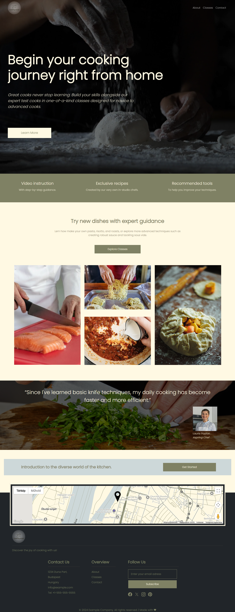
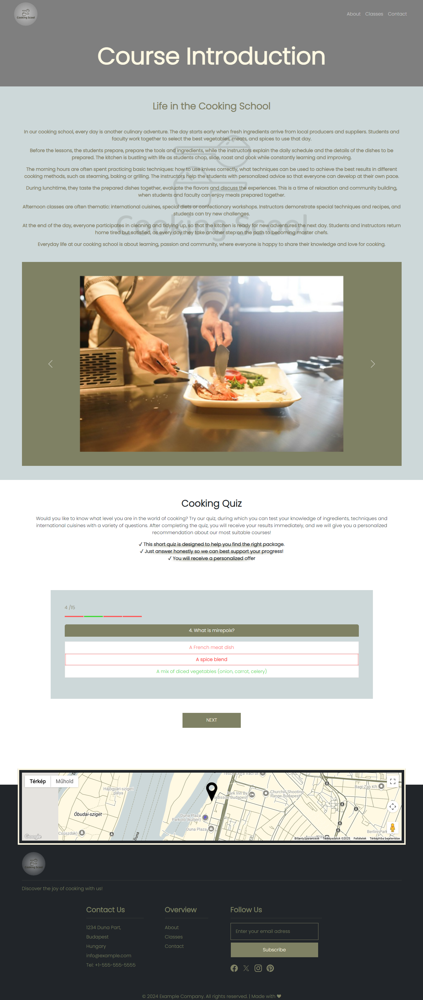
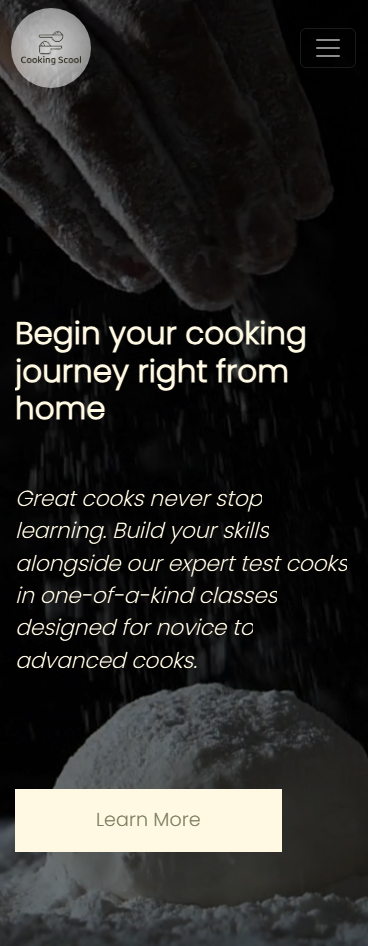

# 👩‍🍳 Cooking School

---

---

## 📚 Table of contents

- [Overview](#Overview)
- [Features](#features)
- [Built with](#built-with)

## 📝 Overview

Cooking School is a fully responsive, multi-page website that presents a fictional cooking school. The project includes sections for courses, instructors, testimonials, contact information, an interactive quiz, and an embedded map using the Google Maps API. It demonstrates the use of semantic HTML, SCSS-based Bootstrap customization, basic JavaScript interactivity, and third-party API integration.

## ✨ Features

🏫 Multi-Page Structure: Includes Home, Courses, About Us, and Contact pages to simulate a real-world cooking school's website.

📋 Course Listings: Displays various cooking courses with descriptions, images, and pricing info.

👨‍🍳 Meet the Chefs: Introduces instructors with profile cards and brief bios.

💬 Testimonials Section: Showcases feedback from satisfied students.

🧠 Interactive Quiz: Includes a simple quiz to let users test their cooking knowledge in a fun way.

🎨 Bootstrap customization via SCSS: Bootstrap components are styled and overridden using SCSS for a unique look and feel.

📱 Fully Responsive Design: Optimized for smooth display across mobile, tablet, and desktop devices.

🎯 Clean UI & Navigation: Simple, intuitive navigation for a user-friendly browsing experience.

## 🛠️ Built With

- HTML 
- Bootstrap + SCSS
- Vanilla JavaScript
- Google Maps API
